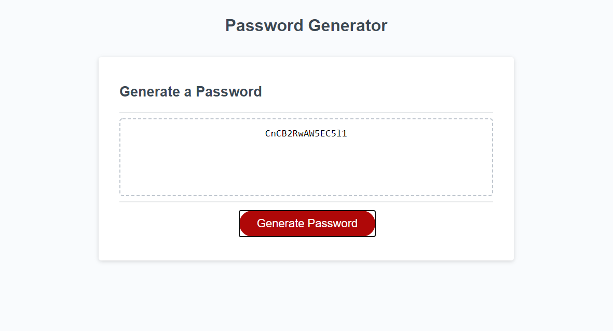

# Portfolio

## Description
This is a portfolio to display contact information, relevant links, and featured projects for my web development career.

## License
[](https://opensource.org/licenses/MIT)

## Built With

* [HTML](https://developer.mozilla.org/en-US/docs/Web/HTML)
* [CSS](https://developer.mozilla.org/en-US/docs/Web/CSS)
* [Git]
* [Github](https://github.com/)

## Deployed Link

* [See Live Site](https://rslepejian.github.io/portfolio/)

## Preview of Working Site


## Code Snippet
This code snippet shows the basic structure of the html used in the small project displays on the webpage.

```html
    <div class="col-md-6">
        <div id="project-3">
            <h4 class = "project-title">Password Generator</h4>
            <h6><a href="https://rslepejian.github.io/JS-password-generator/" target="_blank">Deployed Site</a></h6>
            <h6><a href="https://github.com/rslepejian/JS-password-generator" target="_blank">Github Repository</a></h6>
            
        </div>
    </div>
```

## Authors

* **Raffi Lepejian** 

## Contact Information

- [Link to Portfolio Site](https://rslepejian.github.io/portfolio/)
- [Link to Github](https://github.com/rslepejian)
- [Link to LinkedIn](https://linkedin.com/in/raffi-lepejian-071876153)